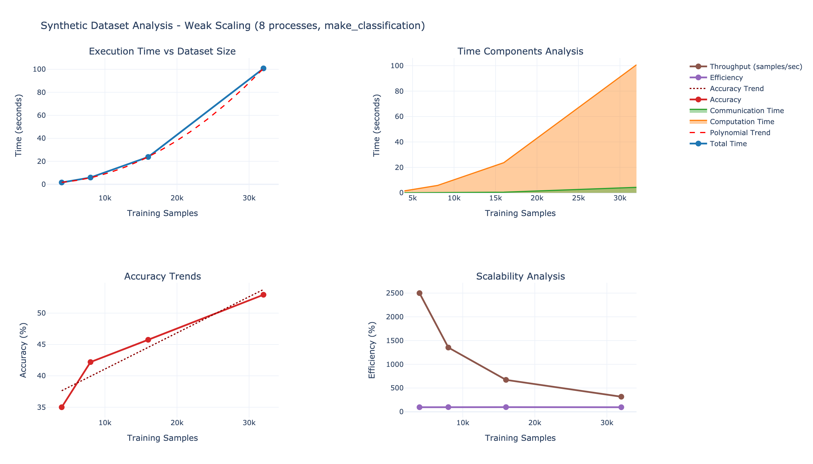
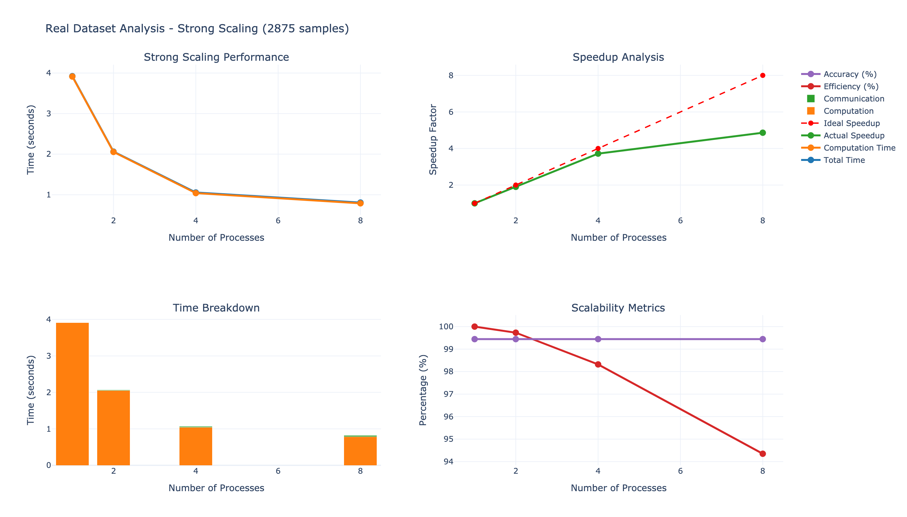

# Práctica dirigida 2 - Paralelización de KNN

## Ejercicio 1 (4pts)

- Paralelice `knn_digits_sec.py`, siguiendo la estructura del ejemplo discutido en clase (`knn_hpc_class_vis.py`). Es decir, debe incluir las directivas de comunicaci´on (`comm.bcast`, `comm.scatter`, `comm.gather`). (4pts)

El algoritmo `ejercicio_1/knn_digits.py` cuenta con la implementación de un KNN en paralelo.

```bash
mpirun -n 4 python ejercicio_1/knn_digits.py
```

output: 
```bash
Accuracy: 0.9833
Execution time (parallel): 0.2590 sec
```

## Ejercicio 2 (3pts)

 - El código debe obtener los tiempos de ejecución, cómputo y comunicación, así como la precisión del modelo (accuracy). Realice las pruebas en Khipu. Incremente tanto procesos (p) como datos (n). Ya que los datos importados (dígitos) tienen un tamaño constante, se recomienda multiplicar la data para medir escalabilidad o usar `from sklearn.datasets import make_classification` para generar data variada

Corremos el sigiente script: ``ejercicio_2/run_benchmark.sh`` con el objetivo de crear el archivo `ejercicio_2/knn_benchmark_results.csv`

finalmente corremos `ejercicio_2/generate_chart.py` para generar los  siguientes gráficos donde podemos ver a detalle los resultados de estos  experimentos.

#### Análisis de Datos Sintéticos


#### Análisis de Datos Reales


## Ejercicio 3 (4pts)

- Derive la gráfica de speedup de los datos anteriores y genere una gráfica de FLOPs vs. p (FLOP por segundo) y analice el comportamiento del modelo en función a n creciente. Obtenga los FLOP de la región paralelizable (entrenamiento), basada en la fórmula de la distancia entre dos puntos. Indique la relación entre speedup y FLOPs 

Para analizar el comportamiento del modelo KNN en paralelo, se ha creado un script de análisis completo en `ejercicio_3/analysis_script.py`. Este script realiza un análisis detallado de:

1. Speedup y eficiencia paralela
2. Análisis de FLOP/s
3. Desglose de tiempos de cómputo vs comunicación
4. Análisis de balance de carga


