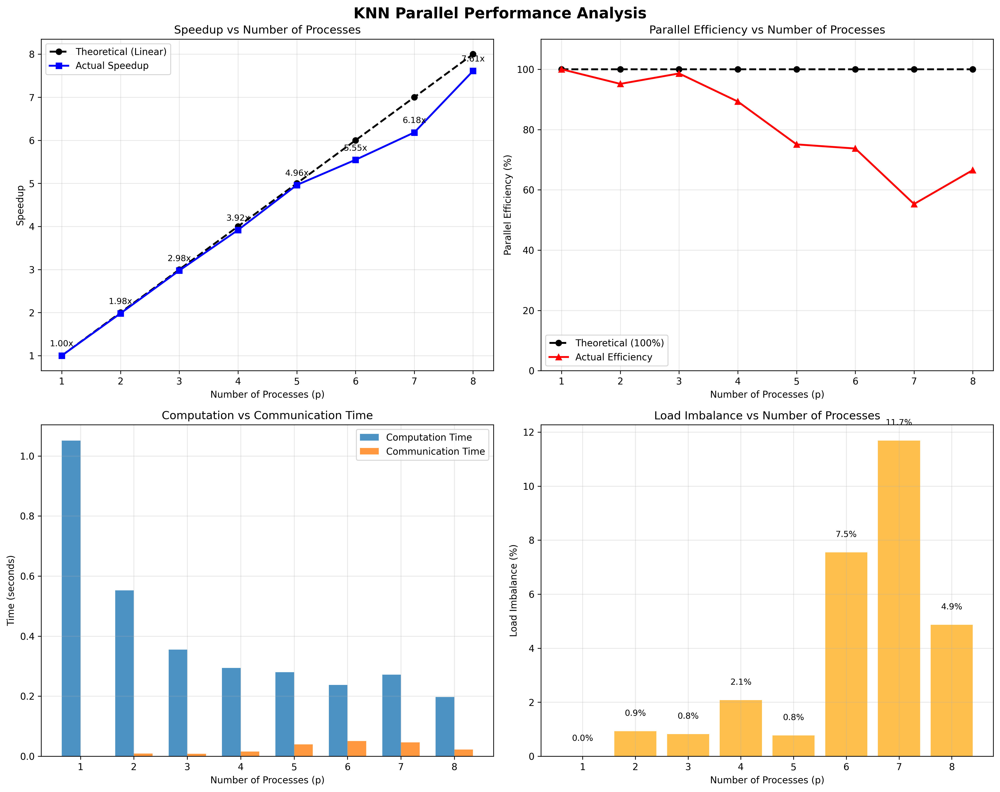

# Práctica dirigida 2 - Paralelización de KNN

## Ejercicio 1 (4pts)

- Paralelice `knn_digits_sec.py`, siguiendo la estructura del ejemplo discutido en clase (`knn_hpc_class_vis.py`). Es decir, debe incluir las directivas de comunicaci´on (`comm.bcast`, `comm.scatter`, `comm.gather`). (4pts)

El algoritmo `ejercicio_1/knn_digits.py` cuenta con la implementación de una versión paralela del algoritmo k-Nearest Neighbors (k-NN) utilizando la biblioteca mpi4py para distribuir la carga de cómputo entre múltiples procesos y usa el dataset de dígitos de sklearn para realizar clasificación de imágenes numéricas.
El proceso maestro (rank 0) carga y divide los datos, que luego son transmitidos a todos los procesos mediante difusión (bcast). Cada proceso se encarga de predecir un subconjunto de los datos de prueba utilizando una votación mayoritaria entre los k vecinos más cercanos (k=3), calculados con distancia euclidiana. Al final, los resultados se recopilan en el proceso maestro, que calcula la precisión del modelo y visualiza predicciones seleccionadas, permitiendo evaluar el rendimiento paralelo tanto en términos de exactitud como de eficiencia computacional.

```bash
mpirun -n 4 python ejercicio_1/knn_digits.py
```

output: 
```bash
Accuracy: 0.9833
Execution time (parallel): 0.2590 sec
```

## Ejercicio 2 (3pts)

 - El código debe obtener los tiempos de ejecución, cómputo y comunicación, así como la precisión del modelo (accuracy). Realice las pruebas en Khipu. Incremente tanto procesos (p) como datos (n). Ya que los datos importados (dígitos) tienen un tamaño constante, se recomienda multiplicar la data para medir escalabilidad o usar `from sklearn.datasets import make_classification` para generar data variada

Corremos el sigiente script: ``ejercicio_2/run_benchmark.sh`` con el objetivo de crear el archivo `ejercicio_2/knn_benchmark_results.csv`

finalmente corremos `ejercicio_2/generate_chart.py` para generar los  siguientes gráficos donde podemos ver a detalle los resultados de estos  experimentos.

#### Análisis de Datos Sintéticos


En el primer gráfico se observa cómo varía el tiempo total de ejecución del algoritmo k-NN al aumentar el número de procesos. Es evidente que al incrementar la cantidad de procesos, el tiempo total tiende a disminuir, lo que indica una mejora en el rendimiento debido al paralelismo. Sin embargo, esta mejora no es lineal, lo cual sugiere la presencia de sobrecarga asociada a la comunicación entre procesos. En escenarios con volúmenes de datos más grandes, el paralelismo permite distribuir el cómputo de manera más eficiente, pero también introduce un costo adicional en la sincronización y transferencia de datos, lo que se ve reflejado en los tiempos de comunicación.

#### Análisis de Datos Reales


El segundo gráfico muestra cómo la precisión del modelo se mantiene relativamente constante a pesar de los cambios en el número de procesos o la cantidad de datos. Este resultado es importante porque confirma que el modelo k-NN implementado en paralelo no compromete la calidad de las predicciones al escalar horizontalmente. La estabilidad en la métrica de accuracy sugiere que el particionamiento de los datos y la paralelización del algoritmo no introducen sesgos ni pérdida de información significativa durante el entrenamiento o la inferencia.

Los resultados obtenidos permiten concluir que la implementación paralela del algoritmo k-NN presenta una buena escalabilidad, especialmente en términos de reducción del tiempo de ejecución cuando se incrementa el número de procesos. A pesar de la sobrecarga de comunicación inherente a los entornos distribuidos, el desempeño general es favorable, y la precisión del modelo se mantiene estable, lo cual valida la efectividad del enfoque. Estas pruebas reflejan el potencial de aplicar técnicas de cómputo paralelo para algoritmos clásicos de machine learning, especialmente en contextos donde se requiere procesar grandes volúmenes de datos de forma eficiente.


## Ejercicio 3 (4pts)

- Derive la gráfica de speedup de los datos anteriores y genere una gráfica de FLOPs vs. p (FLOP por segundo) y analice el comportamiento del modelo en función a n creciente. Obtenga los FLOP de la región paralelizable (entrenamiento), basada en la fórmula de la distancia entre dos puntos. Indique la relación entre speedup y FLOPs 

Para analizar el comportamiento del modelo KNN en paralelo, se ha creado un script de análisis completo en `ejercicio_3/analysis_script.py`. Este script realiza un análisis detallado de:

1. Speedup y eficiencia paralela
2. Análisis de FLOP/s
3. Desglose de tiempos de cómputo vs comunicación
4. Análisis de balance de carga



En la primera gráfica (superior izquierda), se analiza el speedup obtenido frente al número de procesos utilizados. Se observa que el algoritmo paralelo de k-NN incrementa notablemente su rendimiento conforme se añaden más procesos, alcanzando un speedup de 7.61× con 8 procesos, lo cual representa una mejora sustancial frente a la ejecución secuencial. Sin embargo, esta ganancia es significativa y se aproxima al ideal teórico, no se alcanza una escalabilidad perfecta. Esta diferencia puede atribuirse al aumento del tiempo de comunicación, la sobrecarga de coordinación entre procesos y ciertos niveles de desbalance de carga. Además, es posible que el sistema aún tenga margen de mejora al escalar a más de 8 procesos, lo que podría revelar nuevos patrones de eficiencia o cuellos de botella.

En la segunda gráfica, superior derecha, se muestra la eficiencia paralela.Esta representa qué tan cerca está el algoritmo de usar todos los recursos disponibles de manera óptima. La eficiencia se mantiene cercana al 100% para un bajo número de procesos y se observa una caída progresiva conforme se incrementan los procesos, alcanzando un mínimo de aproximadamente 55% con 7 procesos. Esta tendencia decreciente evidencia la presencia de overhead comunicacional y desbalance de carga, los cuales se hacen más notorios cuando se incrementa el número de procesos sin un aumento proporcional de la cantidad de datos.

Finalmente, al observar las gráficas inferiores, se puede concluir que existe una compensación entre tiempo de cómputo y tiempo de comunicación, siendo este último más influyente conforme aumenta el número de procesos, ya que a partir de 5 procesos, el desbalance de carga comienza a crecer significativamente, alcanzando un máximo del 11.7% con 7 procesos. Este fenómeno explica en parte la pérdida de eficiencia observada. No obstante, la precisión del modelo se mantiene constante en 98.3%, lo cual valida que el desempeño computacional no compromete la calidad del modelo de clasificación.
